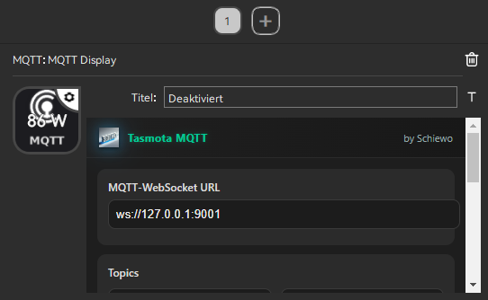
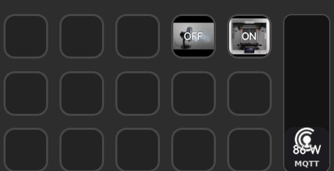
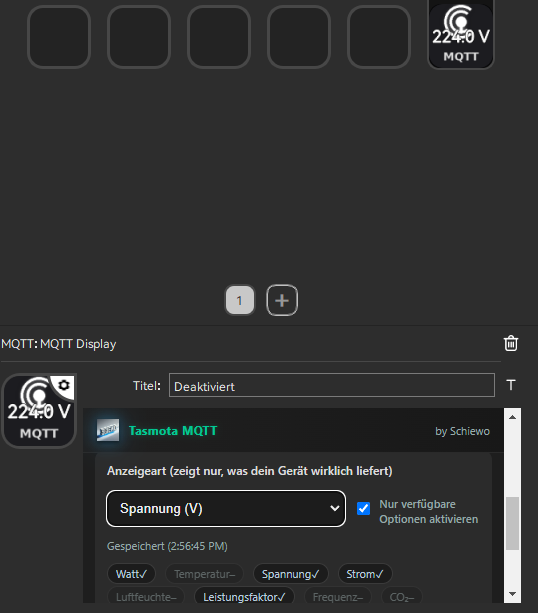

<p align="center">
  
</p>

<h1 align="center">Schiewo Tasmota MQTT Plugin</h1>

<p align="center">
  
</p>


# Tasmota MQTT Plugin for Soomfon 

**by Schiewo**

---

## 🧩 What it does

This plugin lets your StreamDock **display live data from any Tasmota device** using MQTT —
for example: power usage, voltage, temperature, humidity, CO₂, and more.

It automatically detects what values your device sends and shows them directly on the key display.
No extra setup, no JSON parsing, no MQTT coding needed.

---

## ⚙️ Features

✅ Works with **all Tasmota-based devices**  
✅ Supports **MQTT over WebSocket**  
✅ **Auto-detects** ENERGY / SENSOR fields (W, V, °C, %, etc.)  
✅ **Auto language switch** (German 🇩🇪 / English 🇬🇧 — more coming soon)  
✅ Clean, modern **dark UI**  
✅ Easy setup – enter your device base once  
✅ Works on **Soomfon** hardware  

---

## 🧠 Mosquitto Setup

Before installing the plugin, make sure your MQTT broker is configured correctly.

Add the following lines to your Mosquitto configuration  
(for example in `/etc/mosquitto/conf.d/01-listeners.conf`):

```
listener 1883
protocol mqtt
allow_anonymous true

listener 9001
protocol websockets
allow_anonymous true
```

Then restart Mosquitto:
```
sudo systemctl restart mosquitto
```

Your broker is now ready, and you can connect using:
```
ws://<broker-ip>:9001
```

> 💡 No `/mqtt` path is needed with this configuration.

---

## 🪄 Quick Setup

1. Make sure your **MQTT broker** supports WebSockets  
   (e.g. ws://127.0.0.1:9001 — or if your broker uses a WebSocket path, ws://192.168.x.x:9001/mqtt)

2. In the plugin:
   - Enter your **device base name** (e.g. `tasmota_D6763C`)
   - Click **“Fill from base”**

   → The plugin automatically fills your topics:
   ```
   stat/<base>/POWER
   cmnd/<base>/POWER
   ```

3. Choose what you want to display:
   - **Auto (recommended)**
   - Watt (W), Voltage (V), Temperature (°C), Humidity (%), etc.

4. Done!
   The key will now show the latest telemetry from your Tasmota device.

---

## 🌍 Language Support

| Language | Status  |
|-----------|----------|
| **English** | ✅ Default |
| **Deutsch (German)** | ✅ Auto-selected |
| Français, Español, Português, etc. | ➡️ Falls back to English automatically |

Your Soomfon language is detected automatically — no manual setting required.

---

## 🖼️ Screenshots

| Property Inspector (top) | Property Inspector (values) |
|---|---|
|  |  |

| Key grid (Watt) | Key grid (Voltage) |
|---|---|
|  |  |

---

## 🧠 Notes

- This plugin is **Tasmota-only** by design. (Generic MQTT devices are out of scope for stability.)
- All communication happens **locally over MQTT** – no cloud required.
- Tested with Tasmota 13.x+ and Mosquitto broker.

---

## 🧰 Installation (Soomfon)

1. Download this repository or the release ZIP  
2. Place your plugin folder alongside the docs:
   ```
   tasmota-mqtt-plugin/
    ├─ README.md
    ├─ LICENSE
    ├─ screenshots/
    └─ com.schiewo.mqtt.toggle.sdPlugin/
         ├─ manifest.json
         ├─ index.html
         ├─ mqtt.html
         ├─ images/
         │   ├─ brand.png
         │   └─ icon.png
         └─ lib/
             └─ mqtt.min.js
   ```
3. Re-zip the whole `tasmota-mqtt-plugin/` folder  to your plugins directory.

---

## 💬 Contribute / Test

If you want to help test or translate:
- Open a GitHub issue or pull request
- You can easily add your language in the built-in `I18N` block

---

## 🪪 License

MIT License — see `LICENSE` for details.

---

## ❤️ Credits

Created with ❤️ by **Schiewo**  
For the Soomfon StreamDock community.


## 🚀 v1.0 – Stable Release (Auto Path + User/Password + Reconnect)

This update introduces **full automatic WebSocket path detection**, **optional user/password authentication**, and **stable reconnect logic** — making the plugin completely reliable with both local and secured MQTT brokers.

### ✨ New Features

- **Automatic WebSocket path detection**  
  No more manual `/mqtt` or `/ws` paths required.  
  The plugin automatically tests common paths:  
  `""`, `/`, `/mqtt`, `/mqtt/`, `/ws`, `/mqttws`  
  and caches the working one for faster reconnects.

- **Optional Username & Password fields**  
  For brokers that require authentication (non-anonymous access).

- **Auto-Reconnect with Backoff**  
  On any connection loss, the plugin automatically retries with increasing delay until the connection is restored.

- **Local Path Cache**  
  The last working path is stored per host/port for instant reconnect.  
  You can clear it anytime via the Property Inspector.

- **“Clear Path Cache” Button**  
  Added in the Property Inspector for testing, debugging, or switching brokers.  
  It wipes the stored path info and re-triggers automatic detection.

- **Improved startup behavior**  
  Immediate connect on plugin load – no more need to manually toggle `/mqtt`.

---

### ⚙️ Configuration

1. In the Property Inspector, set:
   - **WebSocket URL** → `ws://<broker-ip>:9001`  
     _(No `/mqtt` needed – the plugin auto-detects it.)_
   - **Username / Password** → optional, if your broker requires it  
   - **Topics** →  
     - State: `stat/device/POWER`  
     - Command: `cmnd/device/POWER`
   - Info mode (Watt, Temp, etc.) as desired.

2. Click **“Clear Path Cache”** only if:
   - You switched MQTT brokers or changed the proxy path.
   - You want to force a full re-detection of the WebSocket path.

---

### 🧩 Technical Improvements

- Fully local JavaScript implementation (`mqtt.min.js` included)
- No external CDN dependencies  
- Works with **Soomfon StreamDock**
- Compatible with Mosquitto, Nginx/Traefik WS proxies, and any broker exposing MQTT over WebSockets

---

### 🛠️ Troubleshooting

| Symptom | Possible Cause / Fix |
|----------|----------------------|
| ❌ No connection | Broker WebSocket disabled → ensure `listener 9001` + `protocol websockets` in Mosquitto config |
| Works only with `/mqtt` | Plugin now auto-detects — clear cache and reconnect |
| Wrong or stale connection | Click **“Clear Path Cache”** to force re-detection |
| Authentication failed | Double-check username/password in Property Inspector |
| Info not shown | Verify correct `stat/#` and `tele/#` topics are published by your device |

---

### 🧾 Changelog

#### v1.0 – Stable
- Added automatic WebSocket path detection (`/`, `/mqtt`, `/ws`, …)
- Added optional username/password fields
- Added reconnect with backoff and local path cache
- Added “Clear path cache” button in the Property Inspector
- Improved connection stability and startup behavior

#### v1.0
- Initial working version with MQTT toggle and live info display

---

### 🧑‍💻 Developer Notes

- `index.html` now includes `AutoClient` with reconnect and path-detection logic.  
- `pi/mqtt.html` includes user/password fields and the “Clear Cache” button.  
- `manifest.json` unchanged (action definitions remain compatible).  
- Cache key: `mqtt_ws_path_cache_v1` in localStorage.

